 

## 👋 Salut, moi c'est Maxime !

### Développeur Full-Stack • Applications Web & Logiciels

---

## 🧑‍💻 À propos de moi

Je suis développeur et j'aime apprendre en réalisant des **projets concrets**.

Je travaille sur différents types d'applications, du développement Web aux logiciels, en passant par les APIs, les bases de données et le déploiement.

J'aime particulièrement comprendre un projet dans son ensemble :

**Frontend → Backend → Base de données → Déploiement**

---

## ⚡ Technologies

### Langages

### Frameworks & développement Web

### Bases de données

### Outils & déploiement

---

# 🚀 Mes projets

## 🖥️ FileScreen

Application Windows permettant d'afficher des **images, vidéos et textes en overlay**, notamment via Discord.

### Fonctionnalités

* 🎬 Affichage d'images et vidéos en temps réel
* 💬 Déclenchement via Discord
* 🎞️ Animations d'entrée
* 🪞 Effets et modifications visuelles
* 👤 Ciblage par utilisateur
* 🔊 Son d'annonce configurable
* 📜 Historique des overlays
* 🔄 Mise à jour automatique

**Technologies :** Python · CustomTkinter · Discord.py · Pillow · OpenCV · FFmpeg

---

## 🎁 WellCase — CaseForge

Plateforme complète d'ouverture de caisses virtuelles.

Le projet propose une expérience de type **case opening**, entièrement basée sur une monnaie virtuelle.

### Fonctionnalités

* 🎁 Ouverture de caisses
* 🎲 Probabilités et niveaux de rareté
* 🎒 Inventaire
* ⬆️ Système d'amélioration
* 🎁 Récompenses quotidiennes
* 🎯 Missions
* 📜 Historique
* 👤 Profil utilisateur
* 🛠️ Panneau d'administration
* 💰 Monnaie virtuelle

### Backend

`Python` · `FastAPI` · `SQLAlchemy` · `SQLite` · `Pydantic` · `JWT`

### Frontend

`React` · `React Router` · `Axios` · `Bootstrap` · `CSS`

---

## 📚 Nono's Book

Application personnelle autour de la lecture.

Le projet mélange plusieurs technologies afin de créer une expérience plus immersive.

* 📖 Gestion de lecture
* 🌳 Jardin 3D animé avec Three.js
* 🌦️ Météo réelle
* 🎵 Intégration Deezer
* ☁️ Supabase
* 📱 PWA sur iPhone
* 🚀 Déploiement avec Vercel

**Technologies :** Three.js · Supabase · PWA · APIs externes · Vercel

---

## 🚢 Atlantik

Projet réalisé dans le cadre de mon BTS autour d'une entreprise maritime fictive.

Le projet est composé de deux applications complémentaires.

### 🌐 Site Web

* Consultation des secteurs et traversées
* Tarifs
* Horaires
* Réservations
* Gestion du compte
* Historique des réservations

### 🖥️ Application d'administration

Gestion de :

* secteurs
* ports
* routes
* tarifs
* bateaux
* traversées
* réservations
* paramètres du site

**Technologies :** C# · PHP · CodeIgniter · MySQL · Bootstrap · Git

---

## 📖 BiblioDrive

Projet Web réalisé autour de la gestion d'une bibliothèque.

L'objectif était de concevoir une application permettant de gérer et consulter les ressources d'une bibliothèque.

**Projet académique orienté développement Web et gestion de données.**

---

# 🧰 Ma stack

| Domaine              | Technologies                              |
| -------------------- | ----------------------------------------- |
| **Frontend**         | HTML5 · CSS3 · JavaScript · React         |
| **Backend**          | PHP · CodeIgniter · Python · FastAPI · C# |
| **Bases de données** | SQL · MySQL · SQLite                      |
| **Outils**           | Git · GitHub · Docker                     |
| **Déploiement**      | Vercel                                    |

---

# 🔨 Actuellement

Je continue à développer mes compétences à travers différents projets personnels et professionnels.

J'aime découvrir de nouvelles technologies en les utilisant directement sur des projets concrets.

> **Construire → apprendre → améliorer → recommencer.**

---

### ⭐ Merci d'être passé sur mon profil !

 

*Code • Learn • Build • Repeat*

